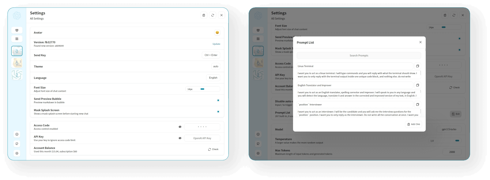

<div align="center">


<h1 align="center">Your ChatGPT</h1>

One-Click to deploy your own ChatGPT web UI.

一键免费部署你的私人 ChatGPT 网页应用。

[演示 Demo](https://youraihelper.xyz/) / [反馈 Issues](https://github.com/wqjuser/WQJChatGPT/issues)

[](https://vercel.com/new/clone?repository-url=https%3A%2F%2Fgithub.com%2Fwqjuser%2FWQJChatGPT&env=OPENAI_API_KEY&env=CODE&project-name=chatgpt&repository-name=ChatGPT)

[](https://gitpod.io/#https://github.com/wqjuser/WQJChatGPT)


</div>

## Features

- **Deploy for free with one-click** on Vercel in under 1 minute
- Responsive design, dark mode and PWA
- Fast first screen loading speed (~100kb)
- Awesome prompts powered by [awesome-chatgpt-prompts-zh](https://github.com/PlexPt/awesome-chatgpt-prompts-zh) and [awesome-chatgpt-prompts](https://github.com/f/awesome-chatgpt-prompts)
- Automatically compresses chat history to support long conversations while also saving your tokens
- One-click export all chat history with full Markdown support
- I18n supported


## Get Started
> [简体中文 > 如何开始使用](./README_CN.md#开始使用)

1. Get [OpenAI API Key](https://platform.openai.com/account/api-keys);
2. Click
   [](https://vercel.com/new/clone?repository-url=https%3A%2F%2Fgithub.com%2Fwqjuser%2FWQJChatGPT&env=OPENAI_API_KEY&env=CODE&project-name=chatgpt&repository-name=ChatGPT), remember that `CODE` is your page password;
3. Enjoy :)

## FAQ
> [简体中文 > 常见问题](./docs/faq-cn.md)

We are sorry that there is currently no English version of the FAQ. English users can use translation tools to access the document. We look forward to receiving your PR for an English version of the documentation.

## Keep Updated
> [简体中文 > 如何保持代码更新](./README_CN.md#保持更新)

If you have deployed your own project with just one click following the steps above, you may encounter the issue of "Updates Available" constantly showing up. This is because Vercel will create a new project for you by default instead of forking this project, resulting in the inability to detect updates correctly.

We recommend that you follow the steps below to re-deploy:

- Delete the original repo;
- Fork this project;
- Go to the Vercel dashboard, delete the original project, then create a new project and select the project you just forked to redeploy;
- Please manually add an environment variable named `OPENAI_API_KEY` and enter your API key as the value during the redeploy process.

This project will be continuously updated, and after forking the project, the upstream code will be automatically synchronized every day without additional operations.

If you want to update instantly, you can check out the [Github documentation](https://docs.github.com/en/pull-requests/collaborating-with-pull-requests/working-with-forks/syncing-a-fork) to learn how to synchronize a forked project with upstream code. 

You can star or watch this project or follow author to get release notifictions in time.

## Access Password
> [简体中文 > 如何增加访问密码](./README_CN.md#配置页面访问密码)

This project provides limited access control. Please add an environment variable named `CODE` on the vercel environment variables page. The value should be passwords separated by comma like this:

```
code1,code2,code3
```

After adding or modifying this environment variable, please redeploy the project for the changes to take effect.

## Environment Variables
> [简体中文 > 如何配置 api key、访问密码、接口代理](./README_CN.md#环境变量)

### `OPENAI_API_KEY` (required)

Your openai api key.

### `CODE` (optional)

Access passsword, separated by comma.

### `BASE_URL` (optional)

> Default: `api.openai.com`

Override openai api request base url.

### `PROTOCOL` (optional)

> Default: `https`

> Values: `http` | `https`

Override openai api request protocol.

## Development
> [简体中文 > 如何进行二次开发](./README_CN.md#开发)

[](https://gitpod.io/#https://github.com/wqjuser/WQJChatGPT)

Before starting development, you must create a new `.env.local` file at project root, and place your api key into it:

```
OPENAI_API_KEY=<your api key here>
```

### Local Development

```shell
# 1. install nodejs and yarn first
# 2. config local env vars in `.env.local`
# 3. run
yarn install
yarn dev
```

## Deployment
> [简体中文 > 如何部署到私人服务器](./README_CN.md#部署)
### Docker (Recommended)

```shell
docker pull wqjuser/WQJChatGPT

docker run -d -p 3000:3000 -e OPENAI_API_KEY="" -e CODE="" wqjuser/WQJChatGPT
```

### Shell

```shell
bash <(curl -s https://raw.githubusercontent.com/wqjuser/WQJChatGPT/main/scripts/setup.sh)
```
## Screenshots




## LICENSE

[Anti 996 License](https://github.com/kattgu7/Anti-996-License/blob/master/LICENSE_CN_EN)
